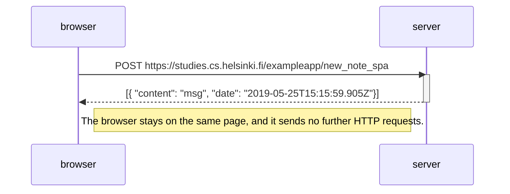

```mermaid
sequenceDiagram
participant browser
participant server

    browser->>server: POST https://studies.cs.helsinki.fi/exampleapp/new_note_spa
    activate server
    server-->>browser: [{ "content": "msg", "date": "2019-05-25T15:15:59.905Z"}]
    deactivate server

    Note right of browser: The browser stays on the same page, and it sends no further HTTP requests.
```
